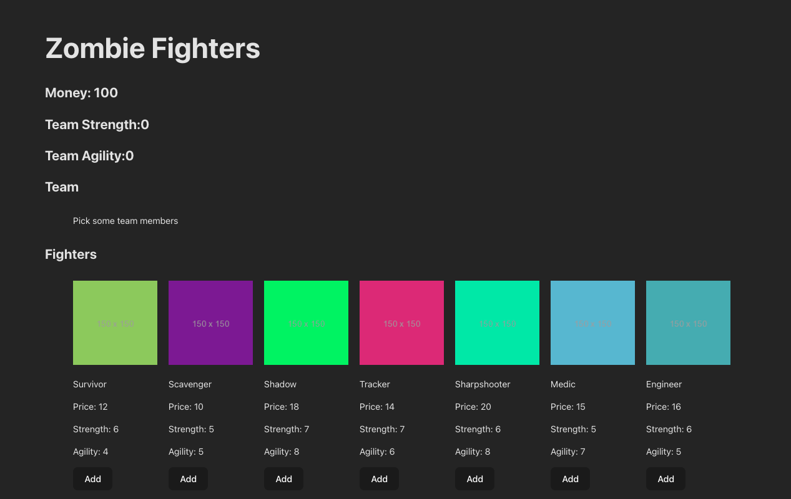

# React State Management Lab
Welcome to Reactville, a constantly evolving virtual metropolis. Let’s build this digital town together, one component at a time.


## About
Reactville is on high alert! As bizarre rumors turn into chilling reality, the city council has called for immediate action to safeguard the town and its inhabitants - against a looming zombie apocalypse!

Your mission is to strategically assemble a survival team, handpicking members from the city’s diverse population, each bringing their unique skills and quirks. As the city’s newly appointed Survival Strategist, you will manage your team’s skills, resources, and stats.



## Setup 
Open your Terminal application and navigate to your `~/code/ga/labs` directory:

```
cd ~/code/ga/labs
```

Create a new Vite project for your React app:

```
npm create vite@latest
```

You’ll be prompted to choose a project name. Let’s name it `react-state-management-lab`.

* Select a framework. Use the arrow keys to choose the `React` option and hit `Enter`.
* Select a variant. Again, use the arrow keys to choose `JavaScript` and hit `Enter`.

Navigate to your new project directory and install the necessary dependencies:

```
cd react-state-management-lab
npm i
```

Open the project’s folder in your code editor:

```
code .
```

### Configuring ESLint
Before we begin, we need to adjust the ESLint configuration. Add the following rules to the `.eslintrc.cjs` file:

```js
rules: {
  'react-refresh/only-export-components': [
    'warn',
    { allowConstantExport: true },
  ],
  'react/prop-types': 'off', // add this line
  'react/no-unescaped-entities': 'off' // add this line
},
```

The first addition prevents warnings if you’re not declaring types for your props (which we’re not), and the second prevents warnings if you’re using contractions within JSX.

### Clear `App.jsx`
Open the `App.jsx` file in the `src` directory and replace the contents of it with the following:

```jsx
// src/App.jsx

const App = () => {

  return (
    <h1>Hello world!</h1>
  );
}

export default App
```

Clear out the contents of the `App.css` file in the `src` directory. Add the following CSS to the `App.css` file:

```css
ul {
  display: flex;
  flex-wrap: wrap;
}

li {
  list-style: none;
  margin: 10px;
}
```

### Running the development server
To start the development server and view our app in the browser, we’ll use the following command:

```
npm run dev
```

You should see that Vite is available on port number 5173:

```
localhost:5173
```

### GitHub Setup
To add this project to GitHub, initialize a Git repository:

```
git init
git add .
git commit -m "init commit"
```

Make a new repository on GitHub named react-state-management-lab.

Link your local project to your remote GitHub repo:

```
git remote add origin https://github.com/<github-username>/react-state-management-lab.git
git push origin main
```
> Do not copy the above command. It will not work. Your GitHub username will replace `<github-username>` (including the `<` and `>`) in the URL above.
